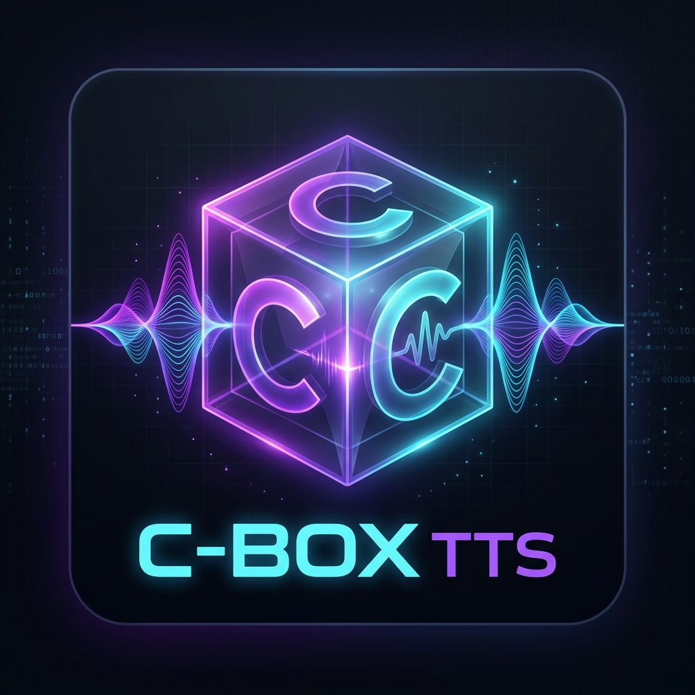

# C-Box TTS Native (Japanese & English Edition)

<p align="center">
  
</p>

完全ローカルかつ超軽量・高速に動作する .NET/C# ネイティブ（WPF）音声合成（TTS）アプリケーションです。  
Python 環境や PyTorch などの巨大な外部依存を一切必要とせず、Windows 上でスタンドアロンかつ即座に動作します。

---

## 🌟 主な特徴

- **完全ローカル・オフライン動作**: 初回起動時のモデル取得後は一切通信を行わず、プライバシーを完全に保護。
- **DirectML ネイティブサポート**: GPU（NVIDIA, AMD, Intel 等）によるハードウェアア- **テキスト正規化 (English Normalizer) & 英語ユーザー辞書**:
  - 英語読み上げ時において、略語展開（`Mr.`, `Dr.`, 月名略語等）、序数（`1st` → `first`）、時刻（`3:00` → `three o'clock`）、年号（`2024` → `twenty twenty-four`）、分数（`1/2` → `one half`）、頭字語（`FBI`, `NASA` 等の不自然なスペルアウト破壊を防ぐ保護）、通貨・セント表記（`$1.50` → `one dollar and fifty cents`、`£100` → `one hundred pounds`）、小数（`3.14` → `three point one four`のpoint/各桁展開）、記号（`%` → `percent`、`@` → `at` 等）、URL/email除去 を含む包括的なテキスト展開で自然な発音を実現。
  - さらに、英語専用のユーザー辞書ファイル（`user_dict_en.txt`）をサポート。単語境界（`\b`）を厳密に考慮した正規表現置換により、NASA などの専門用語や固有名詞のカスタマイズ読み仮名登録が可能。
- **英語読み上げ流暢性・結合処理の大幅な向上**:
  - 英語読み上げ時の合成品質を高めるため、一括合成の文字数閾値を 150 文字から **350 文字** へ大幅に引き上げ。
  - 自己回帰推論の最大トークン数を 400 から **760** へ拡張し、途切れのない滑らかな長文合成に対応。
  - 短いセンテンスが細切れに合成されて発音が崩れるのを防ぐ、英語専用の「短文自動結合ロジック (`MergeShortSentencesForEnglish`)」を搭載。
  - 合成された音声チャンク間を、50ms（1200サンプル）のオーバーラップを用いて滑らかに繋ぐ「クロスフェード結合 (`CrossfadeJoinChunks`)」を実装。クリックノイズや不自然な間（ギャップ）を完全に排除したスラスラとした流暢な英語音声を生成します（※日本語版は、句読点での感情表現や自然な「間」を活かすため、従来通りの無音ギャップ結合を維持）。
- **テキスト処理のセーフガードとトークナイザーの動的制限**:
  - Unicode NFC (FormC) 正規化の導入により、濁音・半濁音の文字分離バグを根本解決。
  - 語彙辞書の読み込み時に、ロードされたモデルの最大語彙インデックス（`MaxValidTokenId`）を動的に検出するようにトークナイザーを改善。これにより、日本語Turboモデルだけでなく、英語（語彙数6561）や多言語（語彙数6563）のモデルにおいても、有効な文字トークンが誤って `UNK (1)` に安全マッピングされることなく、本来の豊かな発音性能を100%発揮可能に。
  - 未知文字・全角記号が検出された場合に自動的にマッピングをクリップし、モデル境界エラーによるクラッシュを防ぐ安全装置を搭載。
- **音声の頭切れ・ぶつ切り対策 (無音パディング & フェード適用)**:
  - 再生環境での音声開始遅延を吸収しポップノイズを防ぐため、合成音声の冒頭（0.15秒）と末尾（0.10秒）に自動的に無音パディングを追加。さらに無音と音声の境界部でのプチ音（クリックノイズ）を完全に防止するため、音声の開始・終了時に滑らかな超短時間フェード（5ms = 120サンプル）を適用。
- **音声の安定性 (Stability / Temperature) 調整**:
  - 自己回帰推論時の安定性パラメータ（Temperature）の制御スライダーを追加。モデル別（英語専用: `0.5`, Turbo: `0.6`, 多言語: `0.7`）にデフォルト値を最適化し、吃りや機械音ノイズを排除したクリアな滑舌を実現。
- **CFG（Classifier-Free Guidance）による流暢性と品質の劇的向上**:
  - Python リファレンス実装と同等の **CFG（Classifier-Free Guidance）** を C# / ONNX 推論エンジンへ移植実装。各推論ステップで条件付き (Conditional) と無条件 (Unconditional) の2パス実行を行いロジットを補間することで、特に長文英語などで破綻しがちだった読み上げをスラスラとした極めて流暢で自然な発音に改善。
  - 無条件パスに入力するダミートークン列の長さおよび位置ID（`0`）のアラインメント調整、および各モデルに合わせた音声開始・終了トークンの適正化により、自己回帰ループ初期での不自然な強制終了（ブチ切れ現象）を完全に克服。
  - GUI 上に「CFG/ペース」スライダーを追加（デフォルト値: `0.5`）。ユーザーの好みに応じて品質とペースを調整可能。
- **ランダムシード固定の撤廃**:
  - 音声生成時の乱数シードを固定値（`42`）から実行ごとの動的生成へと変更。同じテキストを生成する場合でも発音のバリエーション（ピッチやイントネーション of わずかな変化）が生まれ、より自然な人間らしさを表現。
- **参照音声の自動前処理（音量均一化 & トリム）**:
  - 参照音声（ボイスプロンプト）の先頭・末尾の無音区間を自動トリムし、さらに参照音声の録音レベルに依存する特徴抽出のばらつきを防ぐため、音声振幅のピーク値を目標レベル `-1.0 dB` (≒ `0.89`) に自動スケーリング（音量正規化）する処理を導入。10秒制限と併せて、特徴量エンコーダへの入力品質を劇的に改善。
- **セキュリティ・堅牢性の強化**:
  - HTTPダウンロード時の不完全ファイル保護（一時ファイル経由）、スレッドセーフなログ機構、入力テキスト長制限（10,000文字）、リソースリーク防止など、12項目の脆弱性を修正。��字トークンが誤って `UNK (1)` に安全マッピングされることなく、本来の豊かな発音性能を100%発揮可能に。
  - 未知文字・全角記号が検出された場合に自動的にマッピングをクリップし、モデル境界エラーによるクラッシュを防ぐ安全装置を搭載。
- **音声の頭切れ・ぶつ切り対策 (無音パディング & フェード適用)**:
  - 再生環境での音声開始遅延を吸収しポップノイズを防ぐため、合成音声の冒頭（0.15秒）と末尾（0.10秒）に自動的に無音パディングを追加。さらに無音と音声の境界部でのプチ音（クリックノイズ）を完全に防止するため、音声の開始・終了時に滑らかな超短時間フェード（5ms = 120サンプル）を適用。
- **音声の安定性 (Stability / Temperature) 調整**:
  - 自己回帰推論時の安定性パラメータ（Temperature）の制御スライダーを追加。モデル別（英語専用: `0.5`, Turbo: `0.6`, 多言語: `0.7`）にデフォルト値を最適化し、吃りや機械音ノイズを排除したクリアな滑舌を実現。
- **CFG（Classifier-Free Guidance）による流暢性と品質の劇的向上**:
  - Python リファレンス実装と同等の **CFG（Classifier-Free Guidance）** を C# / ONNX 推論エンジンへ移植実装。各推論ステップで条件付き (Conditional) と無条件 (Unconditional) の2パス実行を行いロジットを補間することで、特に長文英語などで破綻しがちだった読み上げをスラスラとした極めて流暢で自然な発音に改善。
  - 無条件パスに入力するダミートークン列の長さおよび位置ID（`0`）のアラインメント調整、および各モデルに合わせた音声開始・終了トークンの適正化により、自己回帰ループ初期での不自然な強制終了（ブチ切れ現象）を完全に克服。
  - GUI 上に「CFG/ペース」スライダーを追加（デフォルト値: `0.5`）。ユーザーの好みに応じて品質とペースを調整可能。
- **ランダムシード固定の撤廃**:
  - 音声生成時の乱数シードを固定値（`42`）から実行ごとの動的生成へと変更。同じテキストを生成する場合でも発音のバリエーション（ピッチやイントネーションのわずかな変化）が生まれ、より自然な人間らしさを表現。
- **参照音声の自動前処理（音量均一化 & トリム）**:
  - 参照音声（ボイスプロンプト）の先頭・末尾の無音区間を自動トリムし、さらに参照音声の録音レベルに依存する特徴抽出のばらつきを防ぐため、音声振幅のピーク値を目標レベル `-1.0 dB` (≒ `0.89`) に自動スケーリング（音量正規化）する処理を導入。10秒制限と併せて、特徴量エンコーダへの入力品質を劇的に改善。
- **セキュリティ・堅牢性の強化**:
  - HTTPダウンロード時の不完全ファイル保護（一時ファイル経由）、スレッドセーフなログ機構、入力テキスト長制限（10,000文字）、リソースリーク防止など、12項目の脆弱性を修正。

---

## 📊 日本語版 (JA) と英語版 (EN) の違い

本アプリケーションは、言語ごとに最適化されたポータブル構成を採用しています。それぞれの主な違いは以下の通りです。

| 比較項目 | 🇯🇵 日本語版 (JA) | 🇺🇸 英語版 (EN) |
| :--- | :--- | :--- |
| **メイン実行ファイル** | `CBoxTTS.Native.JA.exe` | `CBoxTTS.Native.EN.exe` |
| **形態素解析エンジン** | **同梱 (MeCab)**<br>C#版 MeCab (`MeCab.DotNet.dll`) と形態素解析用 IPADIC 辞書 (`dic/`) をすべて内蔵。 | **非搭載 (完全排除)**<br>日本語の解析処理を行わないため、MeCab や辞書ファイルを完全に排除し軽量化。 |
| **サポートする音声モデル** | ・**`Turbo`** (日本語専用・超高速・低遅延)<br>・**`Multilingual`** (多言語・高品質・クローニング対応) | ・**`English`** (英語専用・超高速・高品質)<br>・**`Multilingual`** (多言語・高品質・クローニング対応) |
| **繝・く繧ｹ繝亥・逅・・豁｣隕丞喧** | **譌･譛ｬ隱槫ｰら畑繧ｻ繝ｼ繝輔ぎ繝ｼ繝・*<br>繝ｻUnicode NFC 豁｣隕丞喧縺ｫ繧医ｋ豼・浹繝ｻ蜊頑ｿ・浹蛻・屬繝舌げ菫ｮ豁｣<br>繝ｻ繧､繝ｳ繝・ャ繧ｯ繧ｹ雜・℃ (2453雜・ 譛ｪ遏･譁・ｭ励・閾ｪ蜍輔け繝ｪ繝・・蝗櫁ｷｯ | **English Normalizer & 闍ｱ隱槭Θ繝ｼ繧ｶ繝ｼ霎樊嶌**<br>繝ｻ逡･隱槫ｱ暮幕 (`Mr.`, `Dr.`, 譛亥錐逡･隱樒ｭ・<br>繝ｻ蠎乗焚 (`1st`竊蛋first`)繝ｻ譎ょ綾 (`3:00`竊蛋three o'clock`) 遲峨・繧ｳ繝ｭ繝ｳ菫晁ｭｷ<br>繝ｻ蟷ｴ蜿ｷ (`2024`竊蛋twenty twenty-four`)繝ｻ蛻・焚 (`1/2`竊蛋one half`)繝ｻ騾夊ｲｨ繝ｻ險伜捷<br>繝ｻPC/FA讌ｭ逡檎畑隱槭Θ繝ｼ繧ｶ繝ｼ霎樊嶌 (`user_dict_en.txt`) 讓呎ｺ門酔譴ｱ (CPU, GPU, PLC, SCADA遲・<br>繝ｻ闍ｱ隱樒洒邵ｮ蠖｢ (don't, it's 遲・ 縺ｮ菫晁ｭｷ縲∽ｸ€闊ｬ螟ｧ譁・ｭ怜腰隱・(IT, IS, DAY 遲・ 縺ｮ隱､繧ｹ繝壹Ν繧｢繧ｦ繝磯亟豁｢ |
| **パッケージサイズ** | MeCab 辞書およびモデルを含むため、英語版よりやや大きい。 | 辞書ファイル一式が不要なため、ポータブル構成として極めて軽量。 |

---

## 🛠️ パッケージの構成と場所

ポータブルパッケージのビルドスクリプトを実行すると、以下のディレクトリに完全なポータブル版が構築されます。

### 1. 日本語ポータブル版 (Release_Portable_JA)
*   **パス**: `CBoxTTS.Native/Release_Portable_JA`
*   **メイン実行ファイル**: `CBoxTTS.Native.JA.exe`
*   **特徴**: MeCab辞書および日本語対応モデル（Turbo / Multilingual）を同梱。

### 2. 英語ポータブル版 (Release_Portable_EN)
*   **パス**: `CBoxTTS.Native/Release_Portable_EN`
*   **メイン実行ファイル**: `CBoxTTS.Native.EN.exe`
*   **特徴**: 日本語辞書やMeCabを徹底的に排除した超軽量仕様。英語専用モデル / Multilingualをサポート。

各パッケージの詳細については、同梱およびルートに配置されている仕様書をご覧ください。
- [ポータブル版仕様書_Native_JA.md](ポータブル版仕様書_Native_JA.md)
- [ポータブル版仕様書_Native_EN.md](ポータブル版仕様書_Native_EN.md)

---

## 🚀 使い方

### GUI（ウィンドウ起動）
パッケージ内の `CBoxTTS.Native.JA.exe` または `CBoxTTS.Native.EN.exe` をダブルクリックして起動します。
美麗なダークモード対応のモダンUIで、テキスト入力、パラメータ（話速、感情誇張度等）の調整、リアルタイム再生およびWAVファイルへの書き出し・一括保存を行えます。

### 英語専門用語辞書 (`user_dict_en.txt`) のカスタマイズ
ポータブル版の実行ファイルと同じフォルダに配置されている `user_dict_en.txt` をメモ帳などのテキストエディタで編集することで、独自の専門用語や固有名詞の発音を追加・変更できます。

**【辞書のフォーマット（書き方）】**
* 1行につき1単語とし、**`単語,読み方`** の形式（カンマ区切り）で記述します。
* 読み方は英語のアルファベットの自然な発音（例: A → ay, B → bee, C → see）や、そのまま読ませたい英単語で記述します。
* 先頭が `#` で始まる行はコメントとして無視されます。空行も無視されます。
* 大文字・小文字は区別されず、単語境界（前後にスペースや記号がある場合のみ）で正確に置換されます。

**記述例:**
```text
# 一般的な技術用語のスペルアウト
AI,ay eye
IoT,eye oh tee
TTS,tee tee ess

# 独自の固有名詞
MyTech,my tech
```
※ 辞書ファイルを編集した後は、アプリケーションを再起動することで変更が反映されます。

### CLI（コマンドライン起動・テストハーネス）
コマンドプロンプトまたは PowerShell から `--test` 引数付きで実行することで、GUI を起動せずに音声合成の動作確認が可能です。

```powershell
# 日本語版のテスト実行
.\CBoxTTS.Native.JA.exe --test

# 英語版のテスト実行
.\CBoxTTS.Native.EN.exe --test
```
実行すると、カレントディレクトリにテスト結果の音声ファイル（`test_harness_japanese_out.wav` や `test_harness_english_exclusive_out.wav`）が出力されます。

---

## 📦 ビルド方法（ポータブルパッケージの作成）

開発環境（.NET 10 SDK 導入済み）でポータブルパッケージを自らビルド・パブリッシュするには、`CBoxTTS.Native` フォルダ内の以下のスクリプトを PowerShell から実行します。

*   **日本語版のビルド**: `.\build_portable_ja.ps1`
*   **英語版のビルド**: `.\build_portable_en.ps1`

実行すると、自動的に ReadyToRun の最適化ビルドが行われ、必要な依存ライブラリ、モデルファイル、仕様書がそれぞれのポータブルパッケージフォルダへ自動配置されます。

---

## ⚖️ ライセンス
[MIT License](LICENSE)

## 👏 クレジット
- 推論コアエンジン: [Chatterbox (Resemble AI)](https://github.com/resemble-ai/chatterbox)
- 音響モデル提供およびコミュニティ: [onnx-community](https://huggingface.co/onnx-community)
